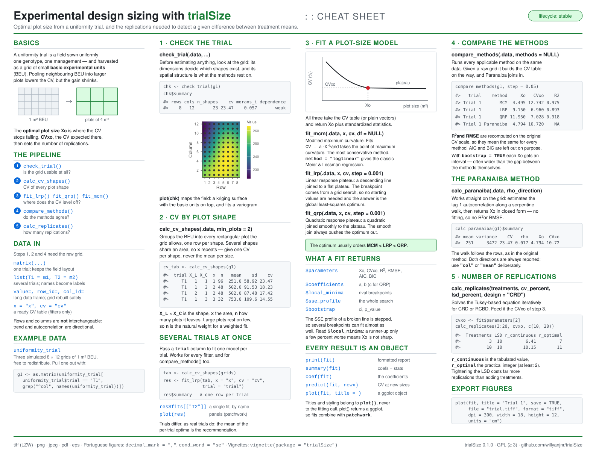

<!-- README.md is generated from README.Rmd. Please edit that file -->

```{r, include = FALSE}
knitr::opts_chunk$set(
  collapse = TRUE,
  comment = "#>",
  fig.path = "man/figures/README-",
  out.width = "100%",
  fig.width = 7,
  fig.height = 4.5,
  dpi = 200
)
```

# trialSizing 

<!-- badges: start -->
[](https://lifecycle.r-lib.org/articles/stages.html#stable)
<!-- badges: end -->

trialSizing provides tools for **experimental design sizing** in agricultural
research: estimating the optimal plot size from a uniformity trial, and the
number of replications needed to detect a given difference between treatments.
Every method returns standardized diagnostic statistics and publication-style
plots that can be saved to TIFF, PDF or PNG.

## Cheat sheet

The whole package on one page, laid out in the order you actually use it.
Click to open it full size — it is an SVG, so it stays sharp at any zoom and
prints on one landscape sheet.

<a href="man/figures/cheatsheet.svg"></a>

## Installation

You can install the development version of trialSizing from
[GitHub](https://github.com/willyanjnr/trialSizing) with:

``` r
# install.packages("pak")
pak::pak("willyanjnr/trialSizing")
```

## The workflow

A plot-size study starts from a **uniformity trial** -- a field sown uniformly
and harvested in a fine grid of small *basic experimental units* (BEU) -- and
walks through a fixed sequence of steps. trialSizing has one function for each:

| Step | Question | Function |
|-----:|----------|----------|
| 1 | Is the grid usable, and how strong is the spatial structure? | `check_trial()` |
| 2 | What is the CV of every plot shape the grid allows? | `calc_cv_shapes()` |
| 3 | At what plot size does the CV stop falling? | `fit_lrp()`, `fit_qrp()`, `fit_mcm()` |
| 4 | How do the methods compare (incl. the closed-form Paranaiba)? | `compare_methods()`, `calc_paranaiba()` |
| 5 | Given that CV, how many replications are needed? | `calc_replicates()` |

The rest of this page follows those steps on one dataset. Everything below uses
`uniformity_trial`, a **simulated** trial bundled with the package (three
8 &times; 12 grids of 1 m&sup2; BEU; see `?uniformity_trial`).

```{r setup, message = FALSE}
library(trialSizing)

# One trial, as the numeric grid the functions expect
grid1 <- as.matrix(uniformity_trial[uniformity_trial$trial == "T1",
                                    grep("^col", names(uniformity_trial))])
dim(grid1)   # 8 rows x 12 columns of 1 m^2 basic units
```

### Step 1 — Check the trial

Before estimating anything, look at the raw grid: its dimensions decide which
plot shapes exist at all, and its spatial autocorrelation is what the whole
method rests on. `check_trial()` reports both, and `plot()` draws the field map.

```{r check}
chk <- check_trial(grid1)
chk
```

### Step 2 — CV by plot shape

`calc_cv_shapes()` groups the BEU into every rectangular plot the grid allows
and returns one row per shape: the plot size `x` (in BEU), the number of plots
`n` of that size, and the coefficient of variation `cv` among them. Several
shapes share the same area, so `x` repeats.

```{r cv-shapes}
cv_tab <- calc_cv_shapes(grid1)
head(cv_tab)
```

This table is the input the plot-size models expect.

### Step 3 — Fit a plot-size model

The CV falls steeply for small plots and then levels off; the plot size where
it stops falling is the optimum. `fit_lrp()` finds it with a Linear Response
Plateau model, by a grid search over the breakpoint (no starting values
needed).

```{r fit}
fit <- fit_lrp(cv_tab, x = "x", cv = "cv", step = 0.05)
fit
```

Title and styling belong to the `plot()` method, which draws the fitted broken
line, the breakpoint and the plateau annotations:

```{r fit-plot}
plot(fit, title = "Uniformity trial T1")
```

To export a figure, use `save = TRUE`; TIFF is written with LZW compression,
and vector formats are available for line art:

``` r
plot(fit, title = "Uniformity trial T1",
     save = TRUE, file = "trial.tiff", format = "tiff", dpi = 300)
```

### Step 4 — Compare methods

The three CV-based models and the closed-form Paranaiba method often give
different optima; the plot size typically increases in the order
MCM &lt; LRP &lt; QRP. `compare_methods()` runs them all from a single grid (it
builds the CV table on the way, and adds Paranaiba because it has the raw
units):

```{r compare}
compare_methods(grid1, step = 0.05)
```

`calc_paranaiba()` can also be called on its own; it works directly on the grid
and returns a closed-form estimate from the first-order spatial
autocorrelation:

```{r paranaiba}
calc_paranaiba(grid1)$summary
```

Because every `plot()` method returns a `ggplot` object, several fits can be
shown side by side with `patchwork`:

``` r
library(patchwork)
lrp <- fit_lrp(cv_tab, x = "x", cv = "cv", step = 0.05)
qrp <- fit_qrp(cv_tab, x = "x", cv = "cv", step = 0.05)
mcm <- fit_mcm(cv_tab, x = "x", cv = "cv")

plot(mcm, title = "MCM", label_size = 3) +
  plot(lrp, title = "LRP", label_size = 3) +
  plot(qrp, title = "QRP", label_size = 3)
```

#### Several trials at once

Pass a data frame (or a list of grids) with a trial column to fit one model per
trial. The result carries a per-trial summary table plus the individual fits
(this works for `fit_lrp()`, `fit_qrp()`, `fit_mcm()` and `compare_methods()`):

```{r multi}
grids <- lapply(split(uniformity_trial, uniformity_trial$trial),
                function(d) as.matrix(d[, grep("^col", names(d))]))

cv_all <- calc_cv_shapes(grids)
res <- fit_lrp(cv_all, x = "x", cv = "cv", trial = "trial", step = 0.05)
res$summary
```

### Step 5 — Number of replications

The CV at the optimal plot size (`CVxo`) feeds directly into the number of
replications needed to detect a given difference between treatment means (as a
percent of the mean), for CRD or RCBD designs:

```{r replicates}
cvxo <- unname(fit$parameters["Breakpoint_Response"])

reps <- calc_replicates(
  treatments  = 3:20,
  cv_percent  = cvxo,
  lsd_percent = c(10, 20),
  design      = "CRD"
)
reps
```

The output reports both `r_continuous` (the tabulated value) and `r_optimal`
(the practical integer, at least 2). Plotting shows how the requirement grows
with the number of treatments, one line per LSD level:

```{r replicates-plot}
plot(reps, title = "Replications needed")
```

## Where to go next

Each step has a dedicated vignette with the theory and the full set of options:
`vignette("check_trial")`, `vignette("cv_shapes")`, `vignette("lrp")`,
`vignette("qrp")`, `vignette("mcm")`, `vignette("paranaiba")`,
`vignette("compare")` and `vignette("replicates")`. The methods are validated
against published results in the tests and in `vignette("validation")`.

## Citation

If you use trialSizing in your research, please cite the underlying methods (see
each function's documentation for the corresponding reference) as well as the
package itself.
