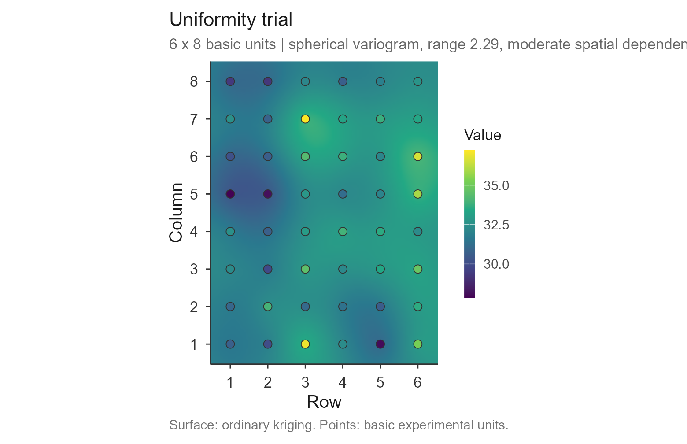
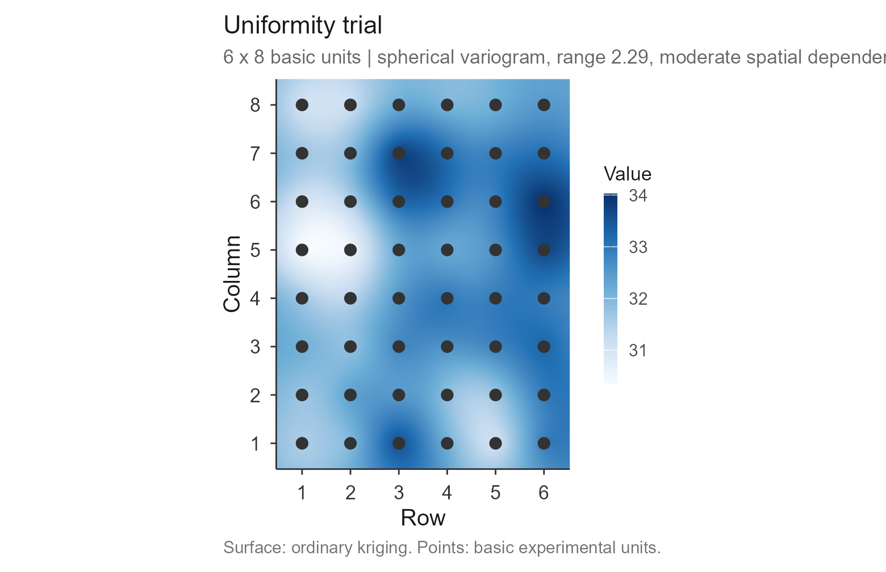
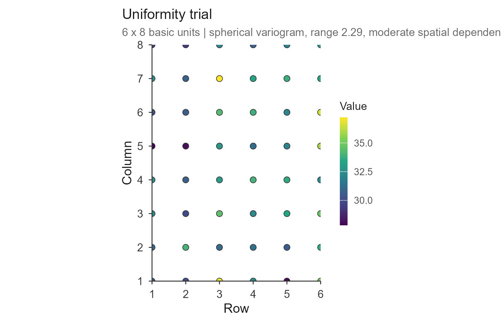
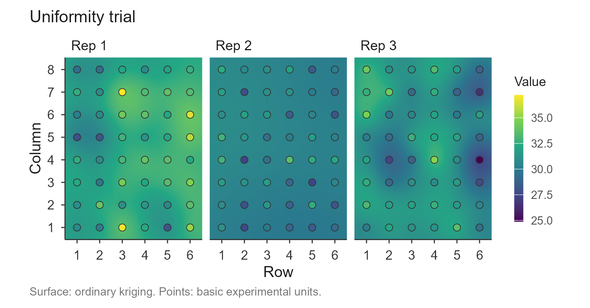

# Checking a uniformity trial

``` r

library(trialSizing)
```

## Why check first

Every method in the package turns a uniformity trial into a recommended
plot size, and every one of them assumes the trial is worth sizing plots
against. A grid with missing cells, a harvest outlier, a fertility
gradient down one side, or – most importantly – no spatial structure at
all, will still produce a number.
[`check_trial()`](https://willyanjnr.github.io/trialSizing/reference/check_trial.md)
is the step that looks at the raw grid of basic experimental units (BEU)
*before* any model is fitted, so the number you get later is one you can
trust.

It reports four things: whether the grid is **structurally** usable,
whether the **values** are sane, whether there is a **trend** across the
field, and how much **spatial structure** the field actually has. All of
it is computed from the standard geostatistical definitions, so the
package depends only on **ggplot2**.

## Data

The example is the simulated uniformity trial shipped with the package
([`?uniformity_trial`](https://willyanjnr.github.io/trialSizing/reference/uniformity_trial.md)):
three trials, each an 8 × 12 grid of 1 m² basic units holding a
biomass-like measurement.

``` r

grid1 <- as.matrix(uniformity_trial[uniformity_trial$trial == "T1",
                                    grep("^col", names(uniformity_trial))])
dim(grid1)
#> [1]  8 12
```

The matrix must preserve the field layout: rows and columns are not
interchangeable, because trend and autocorrelation are directional.

## Running the check

``` r

chk <- check_trial(grid1)
#> Checking 1 trial(s).
chk
#> Uniformity trial check -- Trial 1 
#>   Grid:      8 x 12 = 96 basic units, 0 missing
#>   Shapes:    23 rectangular plot shapes available
#>   Values:    mean 251.013, sd 58.922, CV 23.47%, range [114.590, 368.440]
#>   Outliers:  0 by the boxplot rule
#>   Trend:     rows p = 0.387, columns p = 0.0336
#>   Moran's I: 0.057 (p = 0.367)   rho row 0.059, col 0.104
#>   Variogram: gaussian | nugget 3223.678, sill 3715.746, range 9.54
#>              nugget/sill 0.87 -> weak spatial dependence
#>              little spatial structure: plot size will buy little
#>              precision here, whatever method is used
#>   Issues:    none
```

The printout is the whole diagnostic at a glance. Reading it top to
bottom:

- **Grid / Shapes** – the dimensions and how many rectangular plot
  shapes the grid admits. This matters because the CV-based methods need
  several shapes to fit a curve; a grid whose sides are prime yields
  almost none. The count is flagged when it drops below six.
- **Values / Outliers** – mean, sd, CV, range, and outliers by the
  boxplot rule. In a uniformity trial an outlying unit is usually a
  harvest failure or a typing error, and because it enters every plot
  shape that contains it, it is worth resolving before anything else.
- **Trend** – the p-value of a monotone trend along the rows and along
  the columns. A gradient in one direction is field fertility, and it is
  exactly why shapes of equal area but different orientation give
  different CVs.
- **Moran’s I / rho** – global spatial autocorrelation and the
  first-order autocorrelations that \[calc_paranaiba()\] uses.
- **Variogram** – the fitted model, discussed next.

## Reading the variogram

The fitted variogram gives three numbers that bear directly on plot
size, and they are the reason the check is more than a data audit.

``` r

chk$checks[[1]]$variogram[c("model", "nugget", "sill", "range",
                            "nugget_ratio", "dependence")]
#> $model
#> [1] "gaussian"
#> 
#> $nugget
#> [1] 3223.678
#> 
#> $sill
#> [1] 3715.746
#> 
#> $range
#> [1] 9.543577
#> 
#> $nugget_ratio
#> [1] 0.8675723
#> 
#> $dependence
#> [1] "weak"
```

The **range** is the distance beyond which basic units stop being
correlated. A plot larger than the range is averaging units that are
already independent – which is the spatial reading of the plateau that
[`fit_lrp()`](https://willyanjnr.github.io/trialSizing/reference/fit_lrp.md)
and
[`fit_qrp()`](https://willyanjnr.github.io/trialSizing/reference/fit_qrp.md)
estimate empirically from the CV curve. Seeing the range here, before
fitting, tells you roughly where that plateau should land.

The **nugget-to-sill ratio** is the share of variance with no spatial
structure. Following Cambardella et al. (1994) it is read as strong
dependence (below 0.25), moderate (0.25 to 0.75) or weak (above 0.75).
When it is weak, the field varies almost at random from unit to unit,
and no choice of plot size will buy much precision – worth knowing
before fitting five models to a CV table.

The model is fitted without a spatial-statistics dependency: the range
is profiled over a grid and, at each candidate, the nugget and partial
sill are solved exactly under non-negativity. Spherical, exponential and
Gaussian shapes are all tried and the best weighted fit is kept.

## The field map

The [`plot()`](https://rdrr.io/r/graphics/plot.default.html) method
draws the trial as a map: an ordinary-kriging surface built from that
variogram, with the basic units drawn on top and filled on the same
colour scale. The surface shows where the field is systematically better
or worse; the points show the data the surface came from, so an
interpolation artefact cannot be mistaken for a measurement.

``` r

plot(chk)
```



The default palette is `viridis`, which is perceptually uniform and
readable in greyscale and to colour-blind readers. `"blues"` gives the
classic look, and `point_values = FALSE` draws the units as plain
position markers instead of filling them:

``` r

plot(chk, palette = "blues", point_values = FALSE)
```



When the variogram shows weak spatial dependence the surface is mostly
telling you about the interpolation rather than the field, and
`surface = FALSE` gives the honest picture – the data alone:

``` r

plot(chk, surface = FALSE)
```



Saving works as elsewhere in the package:

``` r

plot(chk, save = TRUE, file = "trial.tiff", format = "tiff", dpi = 300)
```

## Several trials at once

Given a named list of grids, the check runs on each and the summary is
one row per trial:

``` r

grids <- lapply(split(uniformity_trial, uniformity_trial$trial),
                function(d) as.matrix(d[, grep("^col", names(d))]))

check_trial(grids)$summary
#> Checking 3 trial(s).
#>   trial rows cols n_missing n_shapes     mean       cv n_outliers   morans_i
#> 1    T1    8   12         0       23 251.0129 23.47375          0 0.05689653
#> 2    T2    8   12         0       23 256.1666 22.58366          4 0.10942413
#> 3    T3    8   12         0       23 244.5397 24.61861          1 0.08041496
#>      range nugget_ratio dependence n_issues
#> 1 9.543577   0.86757225       weak        0
#> 2 1.429325   0.02860592     strong        0
#> 3 1.386393   0.57994864   moderate        0
```

The maps are then faceted and share one colour scale, which is what
makes them directly comparable:

``` r

plot(check_trial(grids))
#> Checking 3 trial(s).
```



## When the grid is awkward

A grid whose sides are prime admits almost no plot shapes, and the check
says so rather than letting the CV-based methods fail later:

``` r

check_trial(matrix(rnorm(77, 100, 10), nrow = 7))$checks[[1]]$issues
#> Checking 1 trial(s).
#> [1] "only 3 plot shape(s) available from a 7 x 11 grid"
```

Fitting the variogram is the only appreciable computation. With a very
large grid, or when you only want the structural and value checks,
`variogram = FALSE` skips it.

## Where this fits

[`check_trial()`](https://willyanjnr.github.io/trialSizing/reference/check_trial.md)
is the entry point of the workflow. Once a trial passes, build the CV
table with
[`vignette("cv_shapes")`](https://willyanjnr.github.io/trialSizing/articles/cv_shapes.md),
fit the models with
[`vignette("lrp")`](https://willyanjnr.github.io/trialSizing/articles/lrp.md),
[`vignette("qrp")`](https://willyanjnr.github.io/trialSizing/articles/qrp.md)
and
[`vignette("mcm")`](https://willyanjnr.github.io/trialSizing/articles/mcm.md),
or use the raw grid directly with
[`vignette("paranaiba")`](https://willyanjnr.github.io/trialSizing/articles/paranaiba.md).
To see every method’s recommendation side by side, see
[`vignette("compare")`](https://willyanjnr.github.io/trialSizing/articles/compare.md).

### References

Cambardella, C. A. et al. (1994). Field-scale variability of soil
properties in central Iowa soils. *Soil Science Society of America
Journal*, 58(5), 1501-1511.

Matheron, G. (1963). Principles of geostatistics. *Economic Geology*,
58(8), 1246-1266.

Webster, R. & Oliver, M. A. (2007). *Geostatistics for Environmental
Scientists*, 2nd ed. Wiley, Chichester.
