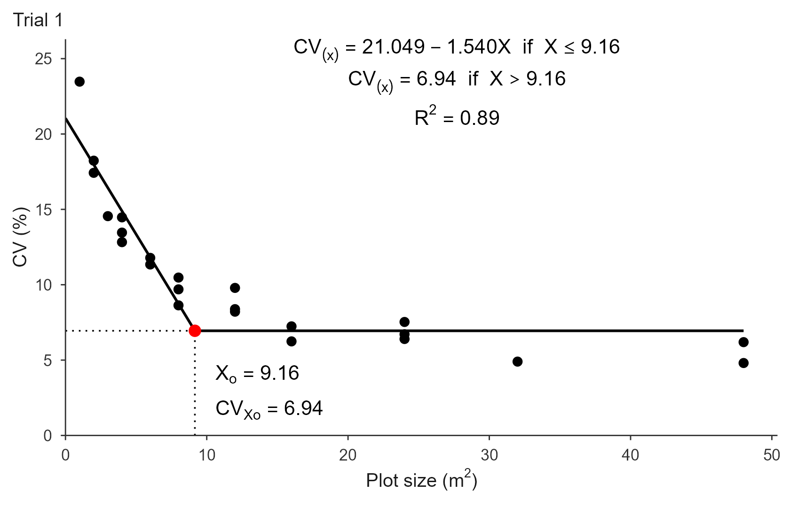
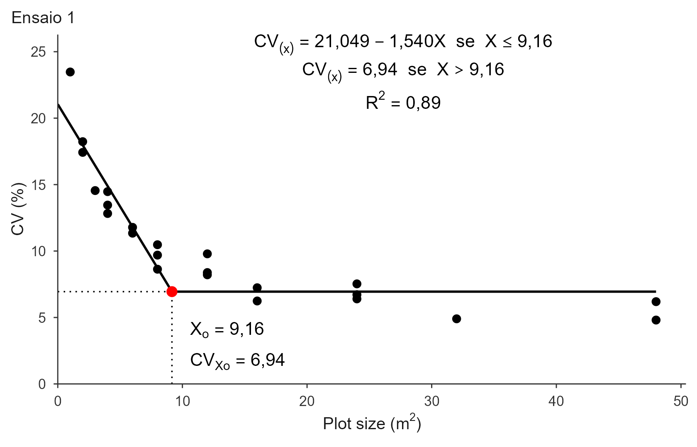
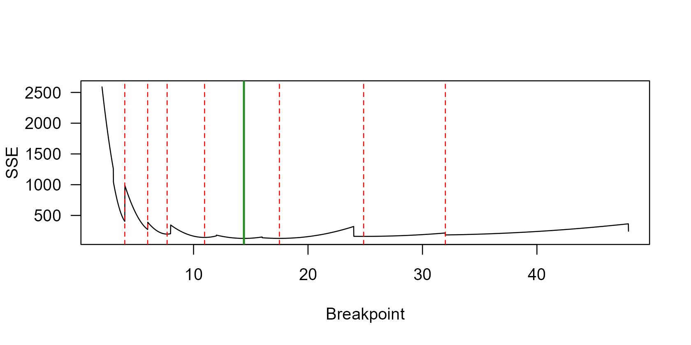

# Linear Response Plateau (LRP)

``` r

library(trialSizing)
```

## Theory

In a uniformity trial, adjacent basic experimental units (BEU) are
grouped into plots of increasing size `X`, and the coefficient of
variation `CV(X)` is computed among plots of each size. The CV falls as
plots get larger, but the gain shrinks: past a certain size, extra area
buys almost no precision. The Linear Response Plateau model formalizes
that as two joined straight lines,

``` math
CV_{(X)} =
\begin{cases}
a + bX + \varepsilon, & \text{if } X \le X_o \\
p + \varepsilon,      & \text{if } X > X_o
\end{cases}
```

The first segment falls with slope $`b < 0`$; the second is flat at the
plateau $`p`$. The join between them is the estimate of interest:
$`X_o`$ is the optimal plot size and $`p = CV_{Xo}`$ is the CV expected
at that size. From the model,

``` math
X_o = \frac{p - a}{b}, \qquad CV_{Xo} = a + b X_o
```

### How the breakpoint is estimated

Fitting a broken line is awkward for general-purpose nonlinear least
squares. The model has a kink, and the residual sum of squares (SSE) is
a *stepped* function of the breakpoint: moving $`X_o`$ between two
observed plot sizes does not change which points fall in each segment,
so the SSE stays flat and its derivative is zero. Gradient-based fitters
such as [`nls()`](https://rdrr.io/r/stats/nls.html) and `nlsLM()` stall
on those flat steps and return whichever basin their starting value
happened to land in.

[`fit_lrp()`](https://willyanjnr.github.io/trialSizing/reference/fit_lrp.md)
avoids this by **profiling** the breakpoint. It walks a fine grid of
candidate values for $`X_o`$; at each candidate the model becomes
linear, so the coefficients come from ordinary least squares. The
candidate with the smallest SSE wins. There are no starting values and
no convergence failures, and the result is the global least-squares
optimum by construction.

That does not make the breakpoint unambiguous, though: the profile may
have several basins that fit almost equally well. See [Competing
breakpoints](#competing-breakpoints) below.

### References

Original method: Paranaíba, P. F., Ferreira, D. F. & Morais, A. R.
(2009). Tamanho ótimo de parcelas experimentais: proposição de métodos
de estimação. *Revista Brasileira de Biometria*, 27(2), 255-268.

The implementation is validated against published results in the package
tests; see Cargnelutti Filho, A., Loro, M. V., Ortiz, V. M. & Andretta,
J. A. (2025). Determinação do tamanho de parcela para avaliar a massa de
parte aérea de grão-de-bico. *Revista Vivências*, 21(43), 499-513.

## Data

The examples use the bundled simulated uniformity trial
([`?uniformity_trial`](https://willyanjnr.github.io/trialSizing/reference/uniformity_trial.md)):
an 8 × 12 grid of 1 m² BEU per trial, grouped by
[`calc_cv_shapes()`](https://willyanjnr.github.io/trialSizing/reference/calc_cv_shapes.md)
into plot shapes. `X` is the plot size in BEU and `CV1`–`CV3` are the
CVs of trials 1 to 3.

``` r

grid_mat <- function(t)
  as.matrix(uniformity_trial[uniformity_trial$trial == t,
                             grep("^col", names(uniformity_trial))])

tab1 <- calc_cv_shapes(grid_mat("T1"))
X   <- tab1$x
CV1 <- tab1$cv
CV2 <- calc_cv_shapes(grid_mat("T2"))$cv
CV3 <- calc_cv_shapes(grid_mat("T3"))$cv
```

Note that `X` repeats: several shapes share the same size (four
different shapes of 6 BEU, for instance). Supply one CV per shape, never
the mean per size, or the fit loses the within-size variability it
needs.

## Basic use

Every fit below passes `step = 0.01` rather than the default `0.001`.
That is only to keep this vignette quick to build, and to keep every
number on this page consistent with the others: the coarser grid already
resolves $`X_o`$ to two decimals, and only the third decimal differs.
See [Fine-tuning](#fine-tuning) for what `step` does.

``` r

fit <- fit_lrp(x = X, cv = CV1, step = 0.01)
fit
#> Linear Response Plateau (LRP) fit
#> Method:                  segment  
#> Breakpoint (Xo):         9.160 
#> CV at breakpoint:        6.945 
#> R2: 0.893  RMSE: 1.513  AIC: 92.3  BIC: 96.9 
#> 
#> Local minima of the SSE profile (8):
#>   Xo =   7.400   SSE  +15.3% vs optimum
#>   Xo =  12.820   SSE  +34.5% vs optimum
#>   Xo =   5.750   SSE  +50.1% vs optimum
#>   ... see $local_minima for all
```

$`X_o \approx 9.2`$ m² with $`CV_{Xo} \approx 6.9\%`$ for trial 1. The
competing minima listed underneath are explained [further
down](#competing-breakpoints).

[`summary()`](https://rdrr.io/r/base/summary.html) splits the model
coefficients from the fit statistics:

``` r

summary(fit)
#> Model coefficients:
#>         a         b 
#> 21.049460 -1.539805 
#> 
#> Goodness of fit:
#>          Breakpoint Breakpoint_Response                  R2                RMSE 
#>           9.1600000           6.9448467           0.8925663           1.5130369 
#>                 AIC                 BIC 
#>          92.3206384          96.8626153
```

Everything is also available directly:

``` r

fit$coefficients
#>         a         b 
#> 21.049460 -1.539805
fit$parameters["Breakpoint"]
#> Breakpoint 
#>       9.16
round(fit$residuals[1:5], 3)
#> [1]  3.964  0.262 -0.545 -1.879 -0.419
```

[`predict()`](https://rdrr.io/r/stats/predict.html) evaluates the fitted
model at any plot size, which is handy to check the plateau behaviour:

``` r

predict(fit, newx = c(1, 5, 12, 15))
#> [1] 19.509655 13.350435  6.944847  6.944847
```

The last two values are identical: past the breakpoint the model is
flat.

## Plot

The [`plot()`](https://rdrr.io/r/graphics/plot.default.html) method
draws the article-style figure. Title and styling go here, not in
[`fit_lrp()`](https://willyanjnr.github.io/trialSizing/reference/fit_lrp.md):

``` r

plot(fit, title = "Trial 1")
```



For Portuguese-language figures, switch the decimal mark and the
conditional word:

``` r

plot(fit, title = "Ensaio 1", decimal_mark = ",", cond_word = "se")
```



Other useful arguments: `annotate_model = FALSE` drops the equation
block, `base_size` / `label_size` / `title_size` scale the text, `theme`
accepts any ggplot2 theme, and `xlab` / `ylab` relabel the axes.

To export, set `save = TRUE`. TIFF is written with LZW compression; PDF
and EPS are vector formats, usually the better choice for line art like
this.

``` r

plot(fit, title = "Trial 1",
     save = TRUE, file = "trial1.tiff", format = "tiff",
     dpi = 300, width = 18, height = 12, units = "cm")
```

## Several trials at once

Pass a data frame plus the column names. One model is fitted per trial:

``` r

trials <- rbind(
  data.frame(x = X, cv = CV1, trial = "Trial 1"),
  data.frame(x = X, cv = CV2, trial = "Trial 2"),
  data.frame(x = X, cv = CV3, trial = "Trial 3")
)

res <- fit_lrp(trials, x = "x", cv = "cv", trial = "trial", step = 0.01)
#> Using x = 'x', cv = 'cv', trial = 'trial' -> 3 trials.
res$summary
#>     trial       a       b breakpoint plateau     R2   RMSE     AIC     BIC
#> 1 Trial 1 21.0495 -1.5398       9.16  6.9448 0.8926 1.5130  92.321  96.863
#> 2 Trial 2 19.3597 -1.0725      14.40  3.9162 0.8341 2.3486 112.547 117.089
#> 3 Trial 3 21.3271 -1.5075      10.11  6.0860 0.8019 2.4137 113.805 118.347
#>   n_local
#> 1       8
#> 2       7
#> 3       8
```

The three breakpoints differ from trial to trial, as real trials do;
their mean is the natural overall recommendation. The `n_local` column
counts competing basins per trial.

The individual fits stay accessible, so any single trial can be
inspected or plotted as usual:

``` r

res$fits[["Trial 2"]]
#> Linear Response Plateau (LRP) fit
#> Method:                  segment  
#> Breakpoint (Xo):         14.400 
#> CV at breakpoint:        3.916 
#> R2: 0.834  RMSE: 2.349  AIC: 112.5  BIC: 117.1 
#> 
#> Local minima of the SSE profile (7):
#>   Xo =  17.500   SSE   +0.2% vs optimum  *
#>   Xo =  10.960   SSE  +12.4% vs optimum
#>   Xo =  24.860   SSE  +25.9% vs optimum
#>   ... see $local_minima for all
#>   * fits within 10% of the optimum (local_min_tol); breakpoint not sharply identified
```

[`plot()`](https://rdrr.io/r/graphics/plot.default.html) on the
multi-trial object arranges the panels in a grid of at most six (3 rows
× 2 columns), paginating into separate figures beyond that. It needs the
**patchwork** package.

``` r

plot(res, decimal_mark = ",", cond_word = "se", label_size = 3)
```

Column names default to `"x"`, `"cv"` and `"trial"`, so
`fit_lrp(trials)` alone works when the data frame already uses those
names. Missing columns produce a clear error rather than a cryptic one:

``` r

fit_lrp(trials, x = "x", cv = "CV", trial = "trial")
#> Error:
#> ! Column(s) not found in `.data`: CV.
#>   Available columns: x, cv, trial.
```

## Competing breakpoints

Uniformity trials rarely have many distinct plot sizes, so the SSE
profile is stepped and often has several local minima. The grid search
always returns the global optimum, but a second basin may fit nearly as
well. When that happens the breakpoint is **not sharply identified**,
and different software will legitimately report different values.

[`fit_lrp()`](https://willyanjnr.github.io/trialSizing/reference/fit_lrp.md)
makes this visible instead of hiding it. Every fit carries
`$local_minima`, listing each basin with its SSE and its excess over the
optimum. Basins fitting within `local_min_tol` (10% by default) are
flagged in the `competing` column and starred by
[`print()`](https://rdrr.io/r/base/print.html). Nothing is signalled by
a warning: stepped profiles almost always have several minima, so a
warning would fire on nearly every fit and stop meaning anything.

``` r

fit2 <- fit_lrp(X, CV2, step = 0.01)
```

``` r

lm2 <- fit2$local_minima
lm2[c("breakpoint", "SSE", "SSE_excess")] <-
  round(lm2[c("breakpoint", "SSE", "SSE_excess")], 3)
lm2
#>   breakpoint     SSE SSE_excess competing
#> 1      17.50 127.138      0.002      TRUE
#> 2      10.96 142.641      0.124     FALSE
#> 3      24.86 159.674      0.259     FALSE
#> 4      32.00 183.044      0.443     FALSE
#> 5       7.69 196.890      0.552     FALSE
#> 6       5.99 271.638      1.141     FALSE
#> 7       3.99 404.290      2.187     FALSE
```

Read the `SSE_excess` column as “how much worse than the optimum”. When
a runner-up basin fits only a few percent worse than the reported
optimum, those two plot sizes are effectively tied and the breakpoint
carries more uncertainty than its decimals suggest. A competitor 30%
worse, in contrast, can be safely dismissed.

The whole profile is available for inspection or plotting:

``` r

prof <- fit2$sse_profile
plot(prof$breakpoint, prof$SSE, type = "l",
     xlab = "Breakpoint", ylab = "SSE", las = 1)
abline(v = fit2$parameters["Breakpoint"], col = "forestgreen", lwd = 2)
abline(v = fit2$local_minima$breakpoint, col = "red", lty = 2)
```



### Reproducing a fit from another package

When a colleague’s [`nls()`](https://rdrr.io/r/stats/nls.html)-based
script or another package reports a different breakpoint, it is usually
because their starting value landed in another basin. The `start`
argument reproduces that solution *without changing the reported fit*,
so you can see exactly what they got and what it cost in fit quality:

``` r

soy_x  <- c(1, 2, 4, 8, 2, 4, 8, 16, 4, 8, 16, 32, 5, 10, 20, 40)
soy_cv <- c(18.699092, 14.130115, 10.321934, 7.990773, 12.690754, 9.995547,
            7.916291, 7.588785, 9.276139, 7.130636, 4.777755, 4.279987,
            8.411412, 5.818440, 3.431264, 3.335962)

seeded <- fit_lrp(soy_x, soy_cv, start = 10.17, step = 0.01)
seeded$compat
#> $start
#> [1] 10.17
#> 
#> $breakpoint
#> [1] 10.17
#> 
#> $coefficients
#>        a        b 
#> 15.76286 -1.08947 
#> 
#> $plateau
#> [1] 4.682951
#> 
#> $SSE
#> [1] 43.17176
#> 
#> $SSE_excess
#> [1] 0.1509463
```

The reported fit is still the optimum at 5.79; `$compat` shows that a
fitter seeded near 10 would stop at 10.17 with an SSE 15% higher. That
is a large enough gap to prefer the optimum, but the number is there for
you to judge, and to cite when reconciling results across software.

### Deciding between basins

A statistically better fit is not automatically the better agronomic
answer. A very early breakpoint can be a “false plateau”: the trial may
lack the range of plot sizes needed for a genuine plateau to emerge, so
the model latches onto a flat stretch that is really just noise. When
two basins are close in SSE, weigh the number of points supporting each
segment, whether the plateau looks plausible on the plot, and what plot
sizes are feasible in the field.

Once you have decided, `search_range` documents the choice explicitly:

``` r

fit_lrp(soy_x, soy_cv, search_range = c(8, 20), step = 0.01)$parameters["Breakpoint"]
#> Breakpoint 
#>       9.54
```

## Fine-tuning

**`search_range`** restricts where the breakpoint is searched, which
helps when an outlier in the transition zone pulls the estimate
somewhere implausible. It must fall inside the data range, and a warning
is issued if the breakpoint lands on the edge of the range you gave.

``` r

fit_lrp(X, CV1, search_range = c(5, 12), step = 0.01)$parameters["Breakpoint"]
#> Breakpoint 
#>       9.16
```

**`step`** is the grid resolution, 0.001 by default. Coarser grids are
faster and slightly less precise:

``` r

fit_lrp(X, CV1, step = 0.01)$parameters["Breakpoint"]
#> Breakpoint 
#>       9.16
```

**`method`** chooses how the linear coefficients are estimated at each
candidate breakpoint. `"segment"` (default) uses only the observations
with `x <= X0`, reproducing the published procedure. `"ramp"` uses every
observation on the basis `pmin(x, X0)`, the standard least-squares LRP;
the plateau points then also inform the descending line, which can shift
the optimum.

``` r

fit_lrp(X, CV1, method = "ramp", step = 0.01)$parameters["Breakpoint"]
#> Breakpoint 
#>       9.16
```

**`local_min_tol`** sets how close a competitor must fit to be flagged
as competing. It changes labelling only, never the fit: lower it (say
`0.02`) to mark only near-ties, raise it to mark any competitor.

``` r

fit_lrp(X, CV2, local_min_tol = 0.02, step = 0.01)$local_minima$competing
#> [1]  TRUE FALSE FALSE FALSE FALSE FALSE FALSE
```

## Warnings worth heeding

Two situations trigger a warning, and both mean the estimate deserves a
second look rather than direct use:

- **Non-negative slope**: the CV is not decreasing with plot size, so
  the “descent then plateau” reading does not hold for these data.
- **Breakpoint at the edge of the search range**: the trial may not span
  enough plot sizes to bracket the true optimum, so the CV may still be
  falling at the largest size evaluated.

A third situation is reported without a warning, because it is too
common for one to be informative: a **competing local minimum**, where
another breakpoint fits nearly as well and the estimate is not sharply
identified. Check the `competing` column of `$local_minima` before
reporting a single value.

## Where to go next

[`vignette("qrp")`](https://willyanjnr.github.io/trialSizing/articles/qrp.md)
and
[`vignette("mcm")`](https://willyanjnr.github.io/trialSizing/articles/mcm.md)
cover the other two CV-based methods, which take the same inputs and
usually give a larger and a smaller optimum respectively. The QRP joins
its plateau smoothly, so its SSE profile is a single smooth basin and
competing minima are rare.
[`vignette("replicates")`](https://willyanjnr.github.io/trialSizing/articles/replicates.md)
shows how $`CV_{Xo}`$ feeds into the number of replications.
