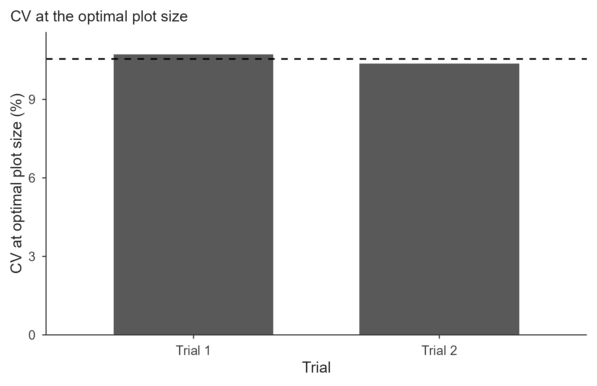

# The Paranaiba method

``` r

library(trialSizing)
```

## Theory

The other three methods start from a table of CVs, one per planned plot
size, and fit a model to it. The Paranaíba method skips that step
entirely: it works on the **raw grid of basic experimental units** and
returns the optimal plot size in closed form, with no model fitting at
all.

The insight is that the whole CV-versus-size curve is driven by how much
neighbouring units resemble one another. If adjacent units are strongly
correlated, grouping them buys little new information and the optimal
plot stays small; if they are independent, larger plots keep paying off.
That similarity is summarized by the first-order spatial autocorrelation
$`\rho`$, and the optimum follows directly:

``` math
X_o = \frac{10 \sqrt[3]{2\,(1 - \rho^{2})\, s^{2}\, m}}{m},
\qquad
CV_{Xo} = \frac{100 \sqrt{(1 - \rho^{2})\, s^{2} / m^{2}}}{\sqrt{X_o}}
```

where $`m`$ and $`s^2`$ are the mean and variance of the BEU values and
$`\rho`$ is the autocorrelation between adjacent units.

Reading the formula gives the intuition directly: $`\rho`$ enters only
through $`(1 - \rho^2)`$, so $`X_o`$ is largest when $`\rho = 0`$
(independent units) and shrinks as $`|\rho|`$ approaches 1 (strong
spatial dependence, in either direction).

### How rho is estimated

The grid is walked in **serpentine** order, left to right along the
first row, right to left along the second, and so on, turning the
two-dimensional grid into a single sequence in which consecutive entries
are physically adjacent. With $`e_i`$ the deviations from the mean along
that path,

``` math
\rho = \frac{\sum_{i=2}^{N} e_i \, e_{i-1}}{\sum_{i=1}^{N} e_i^{2}}
```

The original method walks in the direction of the **rows**, which is the
default here (`rho_direction = "row"`). `"col"` walks down the columns
and `"mean"` averages both. The choice matters: the two directions can
give visibly different $`\rho`$, and therefore different optima,
especially when the field has a gradient along one axis.

### References

Original method: Paranaíba, P. F., Ferreira, D. F. & Morais, A. R.
(2009). Tamanho ótimo de parcelas experimentais: proposição de métodos
de estimação. *Revista Brasileira de Biometria*, 27(2), 255-268.

The formulas are validated against published results in the package
tests; see Cargnelutti Filho, A. et al. (2014). Tamanho de parcela e
número de repetições em aveia preta. *Ciência Rural*, 44(10), 1732-1739,
where
[`calc_paranaiba()`](https://willyanjnr.github.io/trialSizing/reference/calc_paranaiba.md)
reproduces the published $`X_o`$ and $`CV_{Xo}`$ for all nine black-oat
trials of the first evaluation date.

## Data

The example uses the bundled simulated uniformity trial
([`?uniformity_trial`](https://willyanjnr.github.io/trialSizing/reference/uniformity_trial.md)):
8 × 12 grids of 1 m² BEU, each holding a biomass-like measurement in g
m⁻².

``` r

grid_mat <- function(t)
  unname(as.matrix(uniformity_trial[uniformity_trial$trial == t,
                                    grep("^col", names(uniformity_trial))]))
E1 <- grid_mat("T1")
E2 <- grid_mat("T2")
dim(E1)
#> [1]  8 12
```

The matrix must preserve the field layout. Rows and columns are not
interchangeable here: because $`\rho`$ is directional, a transposed grid
gives a different answer.

## Basic use

``` r

fit <- calc_paranaiba(E1)
#> Paranaiba method on 1 trial(s); rho direction = 'row'.
fit
#> Paranaiba optimal plot size
#> Trials: 1  | rho direction: row  | invalid: 0 
#> 
#>    trial    mean variance     CV rho_row rho_col   rho    Xo  CVxo valid
#>  Trial 1 251.013 3471.819 23.474   0.017   0.091 0.017 4.794 10.72  TRUE
```

Both directional estimates are always reported (`rho_row` and
`rho_col`), even though only the one selected by `rho_direction` is used
in `rho` and feeds the formulas. Seeing both is useful: a large gap
between them signals a directional gradient in the field.

``` r

summary(fit)
#> Optimal plot size (Xo) across trials:
#>    Min. 1st Qu.  Median    Mean 3rd Qu.    Max. 
#>   4.794   4.794   4.794   4.794   4.794   4.794 
#> 
#> CV at optimal plot size (CVxo):
#>    Min. 1st Qu.  Median    Mean 3rd Qu.    Max. 
#>   10.72   10.72   10.72   10.72   10.72   10.72
```

The full per-trial table is in `$summary`, and the grids as supplied are
kept in `$matrices`:

``` r

fit$summary[, c("mean", "variance", "CV", "rho", "Xo", "CVxo")]
#>       mean variance       CV        rho       Xo     CVxo
#> 1 251.0129 3471.819 23.47375 0.01655932 4.793933 10.71956
```

## Direction of the walk

``` r

do.call(rbind, lapply(c("row", "col", "mean"), function(d) {
  f <- calc_paranaiba(E1, rho_direction = d)
  data.frame(direction = d, rho = f$summary$rho,
             Xo = f$summary$Xo, CVxo = f$summary$CVxo)
}))
#> Paranaiba method on 1 trial(s); rho direction = 'row'.
#> Paranaiba method on 1 trial(s); rho direction = 'col'.
#> Paranaiba method on 1 trial(s); rho direction = 'mean'.
#>   direction        rho       Xo     CVxo
#> 1       row 0.01655932 4.793933 10.71956
#> 2       col 0.09052249 4.781240 10.69118
#> 3      mean 0.05354090 4.789785 10.71029
```

Here both directional estimates are small, so the choice of direction
barely moves $`X_o`$: $`(1 - \rho^2)`$ is flat near the origin. In a
field with a strong directional gradient the two would differ more and
the choice would matter.

Unless you are deliberately reproducing a study that did otherwise, keep
the default `"row"`, which is the original method.

## Three ways to supply the data

**One matrix**, as above, for a single trial.

**A list of matrices**, for several trials. Names become the trial
labels:

``` r

res <- calc_paranaiba(list(`Trial 1` = E1, `Trial 2` = E2))
#> Paranaiba method on 2 trial(s); rho direction = 'row'.
res
#> Paranaiba optimal plot size
#> Trials: 2  | rho direction: row  | invalid: 0 
#> 
#>    trial    mean variance     CV rho_row rho_col   rho    Xo   CVxo valid
#>  Trial 1 251.013 3471.819 23.474   0.017   0.091 0.017 4.794 10.720  TRUE
#>  Trial 2 256.167 3346.830 22.584   0.146   0.103 0.146 4.639 10.373  TRUE
#> 
#> Mean Xo: 4.72  |  Mean CVxo: 10.55
```

**A long data frame**, with the measurement column plus row and column
indices. The grid is rebuilt from the indices, not from the row order of
the file, which is much safer when data come out of a spreadsheet:

``` r

long <- expand.grid(col = 1:12, row = 1:8)
long$mf <- as.vector(t(E1))

calc_paranaiba(long, value = "mf", row_id = "row", col_id = "col")$summary$Xo
#> Paranaiba method on 1 trial(s); rho direction = 'row'.
#> [1] 4.793933
```

With a `trial` column, one estimate is produced per trial:

``` r

long2 <- rbind(
  transform(long, trial = "Trial 1"),
  transform(expand.grid(col = 1:12, row = 1:8), mf = as.vector(t(E2)),
            trial = "Trial 2")
)

calc_paranaiba(long2, value = "mf", row_id = "row", col_id = "col",
               trial = "trial")$summary[, c("trial", "rho", "Xo", "CVxo")]
#> Paranaiba method on 2 trial(s); rho direction = 'row'.
#>     trial        rho       Xo     CVxo
#> 1 Trial 1 0.01655932 4.793933 10.71956
#> 2 Trial 2 0.14621177 4.638860 10.37281
```

Missing cells are an error rather than a silent gap, and `n_row` /
`n_col` can be passed to assert the expected grid dimensions.

## Plot

``` r

plot(res, title = "Paranaiba: optimal plot size")
```


The dashed line is the mean across trials. Use `y_var = "CVxo"` to show
the CV at the optimum instead:

``` r

plot(res, y_var = "CVxo", title = "CV at the optimal plot size")
```



``` r

plot(res, title = "Paranaiba",
     save = TRUE, file = "paranaiba.tiff", format = "tiff", dpi = 300)
```

## When results are flagged invalid

A trial with zero variance (every unit identical) or a zero mean cannot
produce an estimate: $`\rho`$ is undefined and the formulas divide by
the mean. Those trials get `valid = FALSE` and `NA` results, with a
warning naming the trial, rather than propagating `NaN` quietly into a
summary table.

## How it compares

The Paranaíba estimate uses information the CV-based methods discard,
namely where each unit sits in the field, and it needs no model fitting
or convergence. The trade-off is that it needs the raw grid, which the
CV-based methods do not.

If you have the raw grid, running both is worthwhile: agreement between
a spatial estimate and a CV-curve estimate is reassuring, and
disagreement usually points at a directional gradient worth
investigating before designing the experiment.

See
[`vignette("lrp")`](https://willyanjnr.github.io/trialSizing/articles/lrp.md),
[`vignette("qrp")`](https://willyanjnr.github.io/trialSizing/articles/qrp.md)
and
[`vignette("mcm")`](https://willyanjnr.github.io/trialSizing/articles/mcm.md)
for the CV-based methods, and
[`vignette("replicates")`](https://willyanjnr.github.io/trialSizing/articles/replicates.md)
for turning $`CV_{Xo}`$ into a number of replications.
