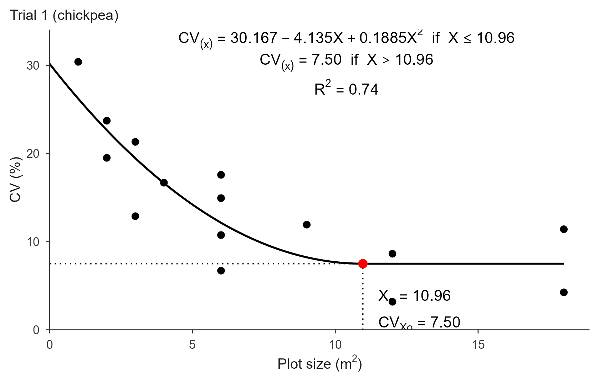
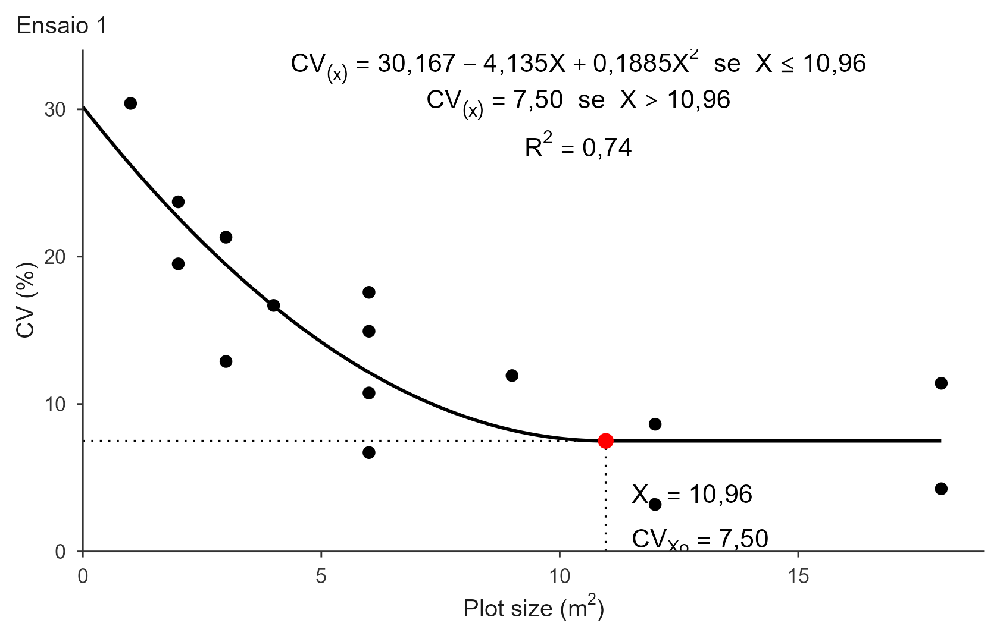

# Quadratic Response Plateau (QRP)

``` r

library(trialSizing)
```

## Theory

The Quadratic Response Plateau model answers the same question as the
LRP, but replaces the straight descent with a curve:

``` math
CV_{(X)} =
\begin{cases}
a + bX + cX^2 + \varepsilon, & \text{if } X \le X_o \\
p + \varepsilon,             & \text{if } X > X_o
\end{cases}
```

The plateau starts where the parabola reaches its vertex, so the two
pieces meet smoothly (no kink, unlike the LRP). That gives closed forms
for both quantities of interest:

``` math
X_o = -\frac{b}{2c}, \qquad CV_{Xo} = p = a - \frac{b^2}{4c}
```

For the curve to descend and then flatten, $`b < 0`$ and $`c > 0`$.

Because the descent is curved rather than straight, the QRP stays above
a straight line for longer and reaches its plateau later. In practice
this means **QRP almost always gives a larger optimum than LRP**, which
in turn gives a larger one than the MCM. That ordering (MCM \< LRP \<
QRP) is reported across many crops and is not a defect of any of the
methods: they answer the same question with different assumptions about
the shape of the decay.

### How the breakpoint is estimated

The published implementations fit this model with
[`nls()`](https://rdrr.io/r/stats/nls.html) or `nlsLM()` and fixed
starting values. That is fragile: the starting values are not derived
from the data, and a failure to converge can pass silently.

[`fit_qrp()`](https://willyanjnr.github.io/trialSizing/reference/fit_qrp.md)
uses the same grid-search strategy as
[`fit_lrp()`](https://willyanjnr.github.io/trialSizing/reference/fit_lrp.md).
Once $`X_o`$ is fixed, the model can be written as

``` math
CV_{(X)} = A + c\,(X - X_o)^2 \ \text{ for } X \le X_o, \qquad
CV_{(X)} = A \ \text{ for } X > X_o
```

which is **linear** in the plateau level $`A`$ and the curvature $`c`$.
So each candidate breakpoint is fitted by ordinary least squares, and
the one with the smallest residual sum of squares is returned. The
reported `a`, `b`, `c` are converted back to the usual parametrization
via $`a = A + cX_o^2`$ and $`b = -2cX_o`$. The result is numerically
identical to a converged [`nls()`](https://rdrr.io/r/stats/nls.html)
fit, without the starting values.

### References

Original method: Peixoto, A. P. B., Faria, G. A. & Morais, A. R. (2011).
Modelos de regressão com platô na estimativa do tamanho de parcelas em
experimento de conservação in vitro de maracujazeiro. *Ciência Rural*,
41(11), 1907-1913.

The implementation is validated against published results in the package
tests; see Cargnelutti Filho, A., Loro, M. V., Ortiz, V. M. & Andretta,
J. A. (2025). Determinação do tamanho de parcela para avaliar a massa de
parte aérea de grão-de-bico. *Revista Vivências*, 21(43), 499-513.

## Data

The bundled simulated uniformity trial
([`?uniformity_trial`](https://willyanjnr.github.io/trialSizing/reference/uniformity_trial.md)),
the same data used throughout the package.

``` r

grid_mat <- function(t)
  as.matrix(uniformity_trial[uniformity_trial$trial == t,
                             grep("^col", names(uniformity_trial))])

tab1 <- calc_cv_shapes(grid_mat("T1"))
X   <- tab1$x
CV1 <- tab1$cv
CV2 <- calc_cv_shapes(grid_mat("T2"))$cv
CV3 <- calc_cv_shapes(grid_mat("T3"))$cv
```

## Basic use

``` r

fit <- fit_qrp(x = X, cv = CV1)
fit
#> Quadratic Response Plateau (QRP) fit
#> Breakpoint (Xo):         11.932 
#> CV at breakpoint:        7.031 
#> R2: 0.918  R2 adj: 0.910  RMSE: 1.324  MAE: 1.069
```

$`X_o \approx 11.9`$ m² for trial 1, noticeably larger than the LRP
estimate of about 9.2 m² on the same data: the smooth join always pushes
the optimum out.

``` r

summary(fit)
#> Model coefficients:
#>          a          b          c 
#> 23.4681004 -2.7551190  0.1154508 
#> 
#> Goodness of fit:
#>          Breakpoint Breakpoint_Response                  R2              R2_adj 
#>          11.9320000           7.0310606           0.9177688           0.9095457 
#>                RMSE                 MAE                 AIC                 BIC 
#>           1.3237244           1.0690865          86.1718395          90.7138163 
#>                 SSE                 MSE 
#>          40.3016648           1.7522463
```

The QRP reports more fit statistics than the LRP: alongside `R2` and
`RMSE` it returns `R2_adj` (adjusted for the extra parameter), `MAE`,
`SSE` and `MSE`.

The closed forms can be checked directly against the coefficients:

``` r

cf <- fit$coefficients
c(vertex = unname(-cf["b"] / (2 * cf["c"])),
  reported = unname(fit$parameters["Breakpoint"]))
#>   vertex reported 
#>   11.932   11.932
```

``` r

predict(fit, newx = c(1, 5, 11, 15))
#> [1] 20.828432 12.578777  7.131344  7.031061
```

## Plot

The figure follows the same layout as the LRP, with the quadratic term
in the annotated equation:

``` r

plot(fit, title = "Trial 1")
```



``` r

plot(fit, title = "Ensaio 1", decimal_mark = ",", cond_word = "se")
```



The curvature coefficient `c` is small, so it gets its own decimal
control, `digits_c` (4 by default), separate from `digits_coef` for `a`
and `b`.

``` r

plot(fit, title = "Trial 1",
     save = TRUE, file = "trial1_qrp.pdf", format = "pdf",
     width = 18, height = 12, units = "cm")
```

## Several trials at once

The data-frame interface is identical to
[`fit_lrp()`](https://willyanjnr.github.io/trialSizing/reference/fit_lrp.md):

``` r

trials <- rbind(
  data.frame(x = X, cv = CV1, trial = "Trial 1"),
  data.frame(x = X, cv = CV2, trial = "Trial 2"),
  data.frame(x = X, cv = CV3, trial = "Trial 3")
)

res <- fit_qrp(trials, x = "x", cv = "cv", trial = "trial")
#> Using x = 'x', cv = 'cv', trial = 'trial' -> 3 trials.
res
#> QRP fits for 3 trials
#> 
#>    trial       a       b      c breakpoint plateau     R2   RMSE     AIC
#>  Trial 1 23.4681 -2.7551 0.1155     11.932  7.0311 0.9178 1.3237  86.172
#>  Trial 2 20.4943 -1.5222 0.0338     22.489  3.3775 0.8666 2.1062 107.535
#>  Trial 3 23.1974 -2.4046 0.0839     14.328  5.9705 0.8298 2.2373 110.314
#>      BIC n_local
#>   90.714       0
#>  112.077       0
#>  114.856       0
```

The summary table carries the extra `c` column, since the QRP has three
coefficients. The three breakpoints average 10.25 m², the article’s QRP
figure.

``` r

res$fits[["Trial 3"]]
#> Quadratic Response Plateau (QRP) fit
#> Breakpoint (Xo):         14.328 
#> CV at breakpoint:        5.971 
#> R2: 0.830  R2 adj: 0.813  RMSE: 2.237  MAE: 1.660
```

``` r

plot(res, label_size = 3)
```

## Fine-tuning

`search_range` and `step` behave exactly as in
[`fit_lrp()`](https://willyanjnr.github.io/trialSizing/reference/fit_lrp.md):

``` r

fit_qrp(X, CV1, search_range = c(6, 15))$parameters["Breakpoint"]
#> Breakpoint 
#>     11.932
fit_qrp(X, CV1, step = 0.01)$parameters["Breakpoint"]
#> Breakpoint 
#>      11.93
```

There is no `method` argument here. The LRP has one because the
published procedure fits the descending line using only the
pre-breakpoint points; the QRP has no such variant.

## Warnings worth heeding

- **Non-positive curvature** (`c <= 0`): the parabola opens downward or
  is flat, so the “descend then plateau” shape does not hold for these
  data.
- **Breakpoint at the edge of the search range**: the trial may not span
  enough plot sizes to bracket the optimum.

## Comparing with the other methods

Fitting all three CV-based methods on the same trial shows the usual
ordering:

``` r

data.frame(
  method = c("MCM", "LRP", "QRP"),
  Xo = c(fit_mcm(X, CV1)$parameters["Breakpoint"],
         fit_lrp(X, CV1)$parameters["Breakpoint"],
         fit_qrp(X, CV1)$parameters["Breakpoint"]),
  row.names = NULL
)
#>   method        Xo
#> 1    MCM  4.494865
#> 2    LRP  9.159000
#> 3    QRP 11.932000
```

Which one to report is a judgement call. The larger optimum is the
conservative choice: it buys more precision at the cost of more field
area. The validation article recommends the LRP value as its overall
answer, while noting that LRP and QRP delivered statistically
indistinguishable precision at the optimum.

See
[`vignette("lrp")`](https://willyanjnr.github.io/trialSizing/articles/lrp.md)
and
[`vignette("mcm")`](https://willyanjnr.github.io/trialSizing/articles/mcm.md)
for the other two methods, and
[`vignette("replicates")`](https://willyanjnr.github.io/trialSizing/articles/replicates.md)
for turning $`CV_{Xo}`$ into a number of replications.
