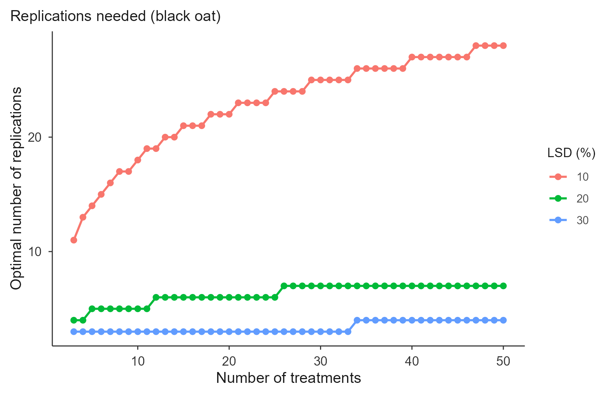
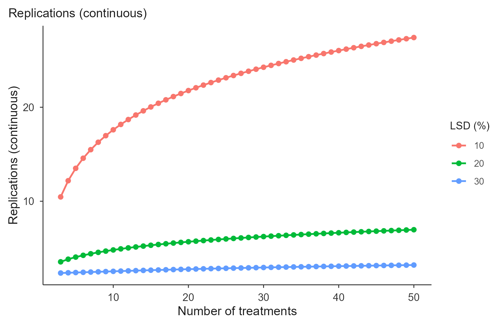

# Number of replications

``` r

library(trialSizing)
```

## Theory

Choosing the plot size settles one half of the design; the other half is
how many times to replicate it. The two are linked: the plot size
determines the experimental precision, expressed as $`CV_{Xo}`$, and
that precision determines how many replications are needed to detect a
given difference between treatment means.

The starting point is the least significant difference of the Tukey
test, expressed as a percentage of the experiment mean:

``` math
d = \frac{q_{\alpha(i;\,GLE)} \sqrt{QME / r}}{m} \times 100
```

where $`q_{\alpha(i;GLE)}`$ is the Tukey critical value for $`i`$
treatments and $`GLE`$ error degrees of freedom, $`QME`$ is the error
mean square, $`r`$ is the number of replications and $`m`$ the mean.
Substituting the experimental coefficient of variation,
$`CV = 100\sqrt{QME}/m`$, and solving for $`r`$:

``` math
r = \left(\frac{q_{\alpha(i;\,GLE)} \cdot CV}{d}\right)^{2}
```

with error degrees of freedom

``` math
GLE = i\,(r - 1) \ \text{ for CRD}, \qquad
GLE = (i - 1)(r - 1) \ \text{ for RCBD}
```

Here $`CV`$ is $`CV_{Xo}`$: the CV expected once the experiment uses the
optimal plot size.

### Why this needs iteration

The expression is circular. The critical value $`q_\alpha`$ depends on
the error degrees of freedom, which depend on $`r`$, which is what we
are solving for. So $`r`$ is obtained iteratively: guess $`r`$, compute
$`GLE`$ and $`q_\alpha`$, get a new $`r`$, repeat until it stops moving.

[`calc_replicates()`](https://willyanjnr.github.io/trialSizing/reference/calc_replicates.md)
runs that fixed point and reports **two readings** of the result:

- `r_continuous`: the converged value, e.g. 10.46. This is what the
  published tables print, and what to quote when comparing with an
  article.
- `r_optimal`: the practical integer, `ceiling(r_continuous)`, floored
  at 2. You cannot run 10.46 replications, and no design runs fewer than
  2.

Smaller $`d`$ means finer resolution, and the cost is steep: because
$`r`$ grows with the square of $`1/d`$, halving the difference you want
to detect roughly quadruples the replications needed.

### References

Method: Cargnelutti Filho, A., Alves, B. M., Toebe, M., Burin, C.,
Santos, G. O., Facco, G., Neu, I. M. M. & Stefanello, R. B. (2014).
Tamanho de parcela e número de repetições em aveia preta. *Ciência
Rural*, 44(10), 1732-1739.

The examples below reproduce Tables 2 (CRD) and 3 (RCBD) of that
article, which use black oat with $`X_o = 4.14`$ m² and
$`CV_{Xo} = 9.25\%`$.

## Basic use

``` r

reps <- calc_replicates(
  treatments  = c(3, 10, 50),
  cv_percent  = 9.25,
  lsd_percent = c(10, 20, 30),
  design      = "CRD"
)
reps
#> Optimal number of replications
#> Design: CRD  CV: 9.25%  alpha: 0.05 
#> Rows: 9  | Non-converged: 0 
#> 
#>  Treatments CV_percent LSD_percent Alpha Design r_continuous r_optimal df_error
#>           3       9.25          10  0.05    CRD        10.46        11       30
#>          10       9.25          10  0.05    CRD        17.60        18      170
#>          50       9.25          10  0.05    CRD        27.41        28     1350
#>           3       9.25          20  0.05    CRD         3.56         4        9
#>          10       9.25          20  0.05    CRD         4.82         5       40
#>          50       9.25          20  0.05    CRD         6.97         7      300
#>  q_tukey converged at_floor
#>    3.486      TRUE    FALSE
#>    4.534      TRUE    FALSE
#>    5.660      TRUE    FALSE
#>    3.948      TRUE    FALSE
#>    4.735      TRUE    FALSE
#>    5.709      TRUE    FALSE
```

Reading the first row: with 3 treatments and a CV of 9.25%, detecting a
difference of 10% of the mean needs 10.46 replications in theory, so 11
in practice. The published table gives 10.46 for that cell.

``` r

summary(reps)
#> Optimal replications (integer) by LSD (%):
#>   LSD_percent r_optimal.min r_optimal.max
#> 1          10            11            28
#> 2          20             4             7
#> 3          30             3             4
```

The full grid is in `$data`, one row per treatments × LSD combination:

``` r

head(reps$data[, c("Treatments", "LSD_percent", "r_continuous",
                   "r_optimal", "df_error", "q_tukey")])
#>   Treatments LSD_percent r_continuous r_optimal df_error  q_tukey
#> 1          3          10    10.461338        11       30 3.486420
#> 2         10          10    17.602589        18      170 4.534275
#> 3         50          10    27.412939        28     1350 5.659947
#> 4          3          20     3.556788         4        9 3.948492
#> 5         10          20     4.820311         5       40 4.734513
#> 6         50          20     6.971561         7      300 5.708613
```

## Design, significance level

Randomized complete blocks need slightly more replications than a
completely randomized design at the same precision, because blocking
costs error degrees of freedom. The gap narrows as the number of
treatments grows:

``` r

rbind(
  CRD  = calc_replicates(c(3, 50), 9.25, 10, design = "CRD")$data$r_continuous,
  RCBD = calc_replicates(c(3, 50), 9.25, 10, design = "RCBD")$data$r_continuous
)
#>          [,1]     [,2]
#> CRD  10.46134 27.41294
#> RCBD 10.96024 27.41574
```

With 3 treatments the difference is 10.46 against 10.95; with 50 it has
practically vanished. Both match the published tables.

A stricter significance level raises the critical value and therefore
the replications:

``` r

rbind(
  `alpha = 0.05` = calc_replicates(10, 9.25, 20, alpha = 0.05)$data$r_continuous,
  `alpha = 0.01` = calc_replicates(10, 9.25, 20, alpha = 0.01)$data$r_continuous
)
#>                  [,1]
#> alpha = 0.05 4.820311
#> alpha = 0.01 6.420760
```

## The full workflow

In practice $`CV_{Xo}`$ comes from one of the plot-size methods rather
than being typed in. Fitting the bundled simulated trial
([`?uniformity_trial`](https://willyanjnr.github.io/trialSizing/reference/uniformity_trial.md))
and feeding the result straight through:

``` r

grid1 <- as.matrix(uniformity_trial[uniformity_trial$trial == "T1",
                                    grep("^col", names(uniformity_trial))])
cv_tab <- calc_cv_shapes(grid1)

lrp  <- fit_lrp(cv_tab, x = "x", cv = "cv")
cvxo <- unname(lrp$parameters["Breakpoint_Response"])
cvxo
#> [1] 6.946387

calc_replicates(treatments = c(5, 10, 20), cv_percent = cvxo,
                lsd_percent = c(10, 20), design = "RCBD")$data[
                  , c("Treatments", "LSD_percent", "r_continuous", "r_optimal")]
#>   Treatments LSD_percent r_continuous r_optimal
#> 1          5          10     8.166458         9
#> 2         10          10    10.202728        11
#> 3         20          10    12.426303        13
#> 4          5          20     2.930601         3
#> 5         10          20     3.074036         4
#> 6         20          20     3.406125         4
```

So a trial designed with plots of about 9 m² would carry an expected CV
near 7%, and the table reads off how many replications are needed to
detect a given difference between treatment means.

## Plot

Over a range of treatments the trade-off becomes visual: one line per
LSD level, showing how the requirement climbs as the number of
treatments grows and as the target difference tightens.

``` r

reps <- calc_replicates(treatments = 3:50, cv_percent = 9.25,
                        lsd_percent = c(10, 20, 30), design = "CRD")

plot(reps, title = "Replications needed (black oat)")
```



The default plots the integer `r_optimal`, which is why the lines are
stepped. For the smooth theoretical curve, plot the continuous value:

``` r

plot(reps, y_var = "r_continuous", title = "Replications (continuous)")
```



``` r

plot(reps, title = "Replications needed",
     save = TRUE, file = "replications.tiff", format = "tiff", dpi = 300)
```

## Reading the results

The article’s conclusion illustrates how these numbers are used in
practice. With a CV of 9.25%, detecting differences of 10% of the mean
would need around 27 replications for 50 treatments, which is not
feasible in the field. Turning the question around and fixing $`r = 4`$,
a common choice in the literature, the detectable difference becomes
about 26.7% of the mean. That is the honest statement of what the
experiment can and cannot resolve.

The function does not pick a precision for you, and it should not: that
decision depends on how large a difference matters agronomically and how
much field area is available. What it does is make the trade-off
explicit before the experiment is installed rather than after.

## Where to go next

[`vignette("lrp")`](https://willyanjnr.github.io/trialSizing/articles/lrp.md),
[`vignette("qrp")`](https://willyanjnr.github.io/trialSizing/articles/qrp.md)
and
[`vignette("mcm")`](https://willyanjnr.github.io/trialSizing/articles/mcm.md)
cover the CV-based plot-size methods that supply $`CV_{Xo}`$;
[`vignette("paranaiba")`](https://willyanjnr.github.io/trialSizing/articles/paranaiba.md)
derives it directly from the raw trial grid.
