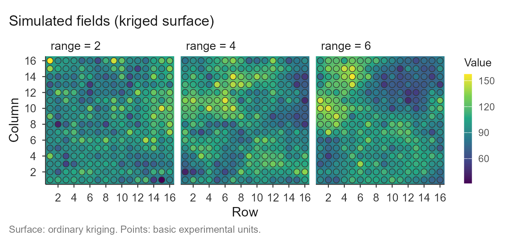
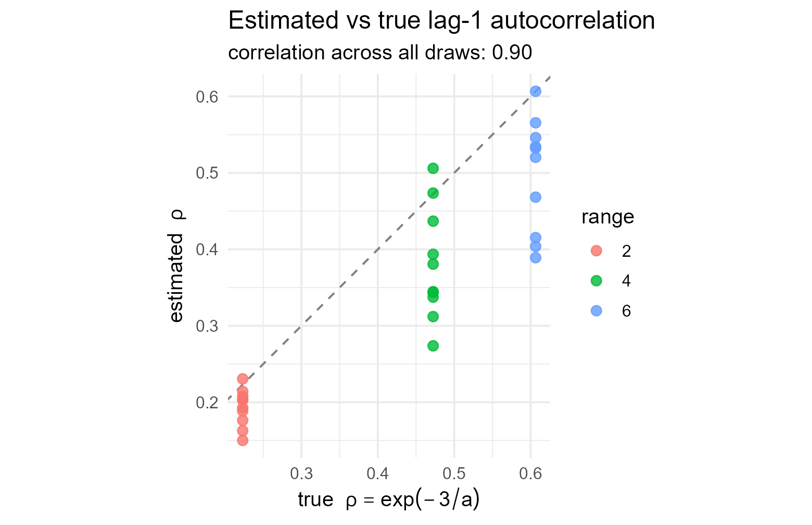

# Validation on simulated fields

``` r

library(trialSizing)
```

## The idea

On real uniformity trials the optimal plot size is unknown – that is the
whole reason to estimate it. To *validate* the methods we need the
opposite: data whose spatial structure is known by construction, so an
estimate can be compared against a truth. This article simulates such
fields and checks what the package recovers.

The fields are drawn from a **Gaussian process with a known exponential
variogram**. Two quantities are then known exactly:

- the **range** of the variogram, `a`, the distance over which basic
  units stay correlated; and
- the **lag-1 autocorrelation** between adjacent units,
  $`\rho = \exp(-3/a)`$, which follows from the effective-range
  convention the package uses ($`\gamma`$ reaches 95% of the sill at
  `a`).

## The generator

A field is one draw from a multivariate normal whose covariance decays
exponentially with distance. Building it needs nothing beyond base R:

``` r

gen_field <- function(nr, nc, range, mu = 100, psill = 350, nugget = 50) {
  xy <- expand.grid(r = seq_len(nr), c = seq_len(nc))
  D  <- as.matrix(dist(xy))
  S  <- psill * exp(-3 * D / range)   # structured covariance, 95% decay at `range`
  diag(S) <- psill + nugget           # nugget: variance with no spatial structure
  z  <- mu + t(chol(S)) %*% rnorm(nr * nc)
  matrix(as.numeric(z), nrow = nr, ncol = nc)
}
```

A larger `range` means smoother fields: neighbours resemble one another
over a longer distance. The three fields below, on a 16 x 16 grid, share
one colour scale, so the increasing spatial structure is visible
directly.

``` r

set.seed(99)
fields <- lapply(c(2, 4, 6), function(a) gen_field(16, 16, range = a))
names(fields) <- paste("range =", c(2, 4, 6))

plot(check_trial(fields), title = "Simulated fields (kriged surface)")
#> Checking 3 trial(s).
```



## Recovering the autocorrelation

The lag-1 autocorrelation is the quantity the Paranaíba method rests on,
and the one a short trial estimates most stably. For each range we draw
several fields, estimate $`\rho`$ with
[`calc_paranaiba()`](https://willyanjnr.github.io/trialSizing/reference/calc_paranaiba.md)
(the average of its two directional walks), and compare it with the
truth $`\exp(-3/a)`$.

``` r

set.seed(2026)
ranges <- c(2, 4, 6)
rho <- do.call(rbind, lapply(ranges, function(a) {
  do.call(rbind, lapply(1:10, function(i) {
    s <- suppressMessages(calc_paranaiba(gen_field(16, 16, a)))$summary
    data.frame(range = a, rho_true = exp(-3 / a),
               rho_est = mean(c(s$rho_row, s$rho_col)))
  }))
}))

agg <- aggregate(cbind(rho_true, rho_est) ~ range, rho, mean)
agg$bias <- agg$rho_est - agg$rho_true
round(agg, 3)
#>   range rho_true rho_est   bias
#> 1     2    0.223   0.193 -0.030
#> 2     4    0.472   0.380 -0.092
#> 3     6    0.607   0.498 -0.108
```

The estimate tracks the truth across the whole range, with a small
downward bias – the familiar attenuation of a lag-1 autocorrelation
estimated from a short series. The relationship is tight across
individual draws, not just on average:

``` r

library(ggplot2)

ggplot(rho, aes(rho_true, rho_est, colour = factor(range))) +
  geom_abline(slope = 1, intercept = 0, linetype = 2, colour = "grey50") +
  geom_point(size = 2.4, alpha = 0.8) +
  labs(title = "Estimated vs true lag-1 autocorrelation",
       subtitle = sprintf("correlation across all draws: %.2f",
                          cor(rho$rho_true, rho$rho_est)),
       x = expression("true  " * rho == exp(-3/a)),
       y = expression("estimated  " * rho),
       colour = "range") +
  coord_equal() +
  theme_minimal(base_size = 12)
```



Points sit just below the identity line: the estimator is slightly
conservative but unbiased in *ordering*, which is what matters when
$`\rho`$ feeds a plot-size formula.

## Response of the CV-curve methods

The plateau methods do not estimate $`\rho`$; they read the optimal plot
size off the CV-versus-size curve built by
[`calc_cv_shapes()`](https://willyanjnr.github.io/trialSizing/reference/calc_cv_shapes.md).
A field with more spatial structure keeps rewarding larger plots for
longer, so the optimum should **grow with the range**. It does:

``` r

set.seed(7)
cv <- do.call(rbind, lapply(ranges, function(a) {
  do.call(rbind, lapply(1:4, function(i) {
    tab <- suppressMessages(calc_cv_shapes(gen_field(16, 16, a)))
    lrp <- fit_lrp(tab, x = "x", cv = "cv", step = 0.25)
    qrp <- fit_qrp(tab, x = "x", cv = "cv", step = 0.25)
    data.frame(range = a,
               LRP = unname(lrp$parameters["Breakpoint"]),
               QRP = unname(qrp$parameters["Breakpoint"]))
  }))
}))
#> Using x = 'x', cv = 'cv' (single series).
#> Using x = 'x', cv = 'cv' (single series).
#> Using x = 'x', cv = 'cv' (single series).
#> Using x = 'x', cv = 'cv' (single series).
#> Using x = 'x', cv = 'cv' (single series).
#> Using x = 'x', cv = 'cv' (single series).
#> Using x = 'x', cv = 'cv' (single series).
#> Using x = 'x', cv = 'cv' (single series).
#> Using x = 'x', cv = 'cv' (single series).
#> Using x = 'x', cv = 'cv' (single series).
#> Using x = 'x', cv = 'cv' (single series).
#> Using x = 'x', cv = 'cv' (single series).
#> Using x = 'x', cv = 'cv' (single series).
#> Using x = 'x', cv = 'cv' (single series).
#> Using x = 'x', cv = 'cv' (single series).
#> Using x = 'x', cv = 'cv' (single series).
#> Using x = 'x', cv = 'cv' (single series).
#> Using x = 'x', cv = 'cv' (single series).
#> Using x = 'x', cv = 'cv' (single series).
#> Using x = 'x', cv = 'cv' (single series).
#> Using x = 'x', cv = 'cv' (single series).
#> Using x = 'x', cv = 'cv' (single series).
#> Using x = 'x', cv = 'cv' (single series).
#> Using x = 'x', cv = 'cv' (single series).

aggregate(cbind(LRP, QRP) ~ range, cv, mean)
#>   range     LRP     QRP
#> 1     2 10.6875 16.7500
#> 2     4 18.3125 27.1250
#> 3     6 20.3125 33.0625
```

Both optima increase monotonically with the generating range: the
methods respond to a controlled change in spatial structure in the
expected direction.

## What this does and does not show

The simulation validates two things cleanly. First, the
**autocorrelation machinery** underneath
[`check_trial()`](https://willyanjnr.github.io/trialSizing/reference/check_trial.md)
and
[`calc_paranaiba()`](https://willyanjnr.github.io/trialSizing/reference/calc_paranaiba.md)
recovers a known $`\rho`$. Second, the **CV-curve optima move in the
right direction** as spatial structure is dialled up.

It also makes an honest limitation visible. There is no single “true
optimal plot size” to recover: the methods target different definitions
and answer different questions. The plateau methods (LRP, QRP) grow with
the range, while the Paranaíba optimum moves the *other* way – it is
largest at $`\rho = 0`$ and shrinks as dependence strengthens, by
construction of its formula (see
[`vignette("paranaiba")`](https://willyanjnr.github.io/trialSizing/articles/paranaiba.md)).
That divergence is a documented property, not an error, and it is
exactly what
[`vignette("compare")`](https://willyanjnr.github.io/trialSizing/articles/compare.md)
is for.

A second caveat worth stating: the *point estimate* of the variogram
range from a single small trial is noisy, so it is not used as a
validation target here. The nugget-to-sill ratio and the autocorrelation
are the more stable readings, which is why
[`check_trial()`](https://willyanjnr.github.io/trialSizing/reference/check_trial.md)
leads with them.

## Extending this to your own scenarios

The generator is the hook. Vary its arguments to build the cases you
care about:

- raise `nugget` toward `psill` to simulate a field with **weak spatial
  dependence**, where every method should return a small optimum and
  [`check_trial()`](https://willyanjnr.github.io/trialSizing/reference/check_trial.md)
  should report a high nugget-to-sill ratio;
- change the grid dimensions to study how few basic units the methods
  tolerate;
- replace the exponential covariance with a spherical or Gaussian one to
  check robustness to the variogram shape.

Wrapping the loops above in a function that returns estimate-minus-truth
is the whole of a validation harness. See
[`vignette("check_trial")`](https://willyanjnr.github.io/trialSizing/articles/check_trial.md)
for the diagnostics and
[`vignette("compare")`](https://willyanjnr.github.io/trialSizing/articles/compare.md)
for reading several methods against each other.
