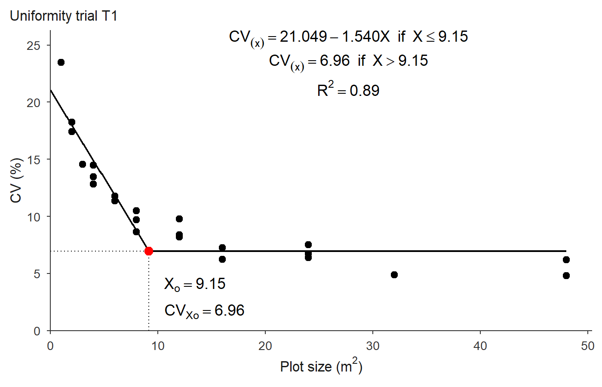

# trialSizing


trialSizing provides tools for **experimental design sizing** in
agricultural research: estimating the optimal plot size from a
uniformity trial, and the number of replications needed to detect a
given difference between treatments. Every method returns standardized
diagnostic statistics and publication-style plots that can be saved to
TIFF, PDF or PNG.

## Cheat sheet

The whole package on one page, laid out in the order you actually use
it. Click to open it full size — it is an SVG, so it stays sharp at any
zoom and prints on one landscape sheet.

[](https://willyanjnr.github.io/trialSizing/man/figures/cheatsheet.svg)

## Installation

You can install the development version of trialSizing from
[GitHub](https://github.com/willyanjnr/trialSizing) with:

``` r

# install.packages("pak")
pak::pak("willyanjnr/trialSizing")
```

## The workflow

A plot-size study starts from a **uniformity trial** – a field sown
uniformly and harvested in a fine grid of small *basic experimental
units* (BEU) – and walks through a fixed sequence of steps. trialSizing
has one function for each:

| Step | Question | Function |
|---:|----|----|
| 1 | Is the grid usable, and how strong is the spatial structure? | [`check_trial()`](https://willyanjnr.github.io/trialSizing/reference/check_trial.md) |
| 2 | What is the CV of every plot shape the grid allows? | [`calc_cv_shapes()`](https://willyanjnr.github.io/trialSizing/reference/calc_cv_shapes.md) |
| 3 | At what plot size does the CV stop falling? | [`fit_lrp()`](https://willyanjnr.github.io/trialSizing/reference/fit_lrp.md), [`fit_qrp()`](https://willyanjnr.github.io/trialSizing/reference/fit_qrp.md), [`fit_mcm()`](https://willyanjnr.github.io/trialSizing/reference/fit_mcm.md) |
| 4 | How do the methods compare (incl. the closed-form Paranaiba)? | [`compare_methods()`](https://willyanjnr.github.io/trialSizing/reference/compare_methods.md), [`calc_paranaiba()`](https://willyanjnr.github.io/trialSizing/reference/calc_paranaiba.md) |
| 5 | Given that CV, how many replications are needed? | [`calc_replicates()`](https://willyanjnr.github.io/trialSizing/reference/calc_replicates.md) |

The rest of this page follows those steps on one dataset. Everything
below uses `uniformity_trial`, a **simulated** trial bundled with the
package (three 8 × 12 grids of 1 m² BEU; see
[`?uniformity_trial`](https://willyanjnr.github.io/trialSizing/reference/uniformity_trial.md)).

``` r

library(trialSizing)

# One trial, as the numeric grid the functions expect
grid1 <- as.matrix(uniformity_trial[uniformity_trial$trial == "T1",
                                    grep("^col", names(uniformity_trial))])
dim(grid1)   # 8 rows x 12 columns of 1 m^2 basic units
#> [1]  8 12
```

### Step 1 — Check the trial

Before estimating anything, look at the raw grid: its dimensions decide
which plot shapes exist at all, and its spatial autocorrelation is what
the whole method rests on.
[`check_trial()`](https://willyanjnr.github.io/trialSizing/reference/check_trial.md)
reports both, and
[`plot()`](https://rdrr.io/r/graphics/plot.default.html) draws the field
map.

``` r

chk <- check_trial(grid1)
#> Checking 1 trial(s).
chk
#> Uniformity trial check -- Trial 1 
#>   Grid:      8 x 12 = 96 basic units, 0 missing
#>   Shapes:    23 rectangular plot shapes available
#>   Values:    mean 251.013, sd 58.922, CV 23.47%, range [114.590, 368.440]
#>   Outliers:  0 by the boxplot rule
#>   Trend:     rows p = 0.387, columns p = 0.0336
#>   Moran's I: 0.057 (p = 0.367)   rho row 0.059, col 0.104
#>   Variogram: gaussian | nugget 3223.678, sill 3715.746, range 9.54
#>              nugget/sill 0.87 -> weak spatial dependence
#>              little spatial structure: plot size will buy little
#>              precision here, whatever method is used
#>   Issues:    none
```

### Step 2 — CV by plot shape

[`calc_cv_shapes()`](https://willyanjnr.github.io/trialSizing/reference/calc_cv_shapes.md)
groups the BEU into every rectangular plot the grid allows and returns
one row per shape: the plot size `x` (in BEU), the number of plots `n`
of that size, and the coefficient of variation `cv` among them. Several
shapes share the same area, so `x` repeats.

``` r

cv_tab <- calc_cv_shapes(grid1)
#> CV by shape for 1 trial(s).
head(cv_tab)
#>     trial X_L X_C x  n      mean        sd       cv
#> 1 Trial 1   1   1 1 96  251.0129  58.92214 23.47375
#> 2 Trial 1   1   2 2 48  502.0258  91.52677 18.23149
#> 3 Trial 1   2   1 2 48  502.0258  87.47753 17.42491
#> 4 Trial 1   1   3 3 32  753.0388 109.57170 14.55061
#> 5 Trial 1   1   4 4 24 1004.0517 145.29792 14.47116
#> 6 Trial 1   2   2 4 24 1004.0517 135.13136 13.45861
```

This table is the input the plot-size models expect.

### Step 3 — Fit a plot-size model

The CV falls steeply for small plots and then levels off; the plot size
where it stops falling is the optimum.
[`fit_lrp()`](https://willyanjnr.github.io/trialSizing/reference/fit_lrp.md)
finds it with a Linear Response Plateau model, by a grid search over the
breakpoint (no starting values needed).

``` r

fit <- fit_lrp(cv_tab, x = "x", cv = "cv", step = 0.05)
#> Using x = 'x', cv = 'cv' (single series).
fit
#> Linear Response Plateau (LRP) fit
#> Method:                  segment  
#> Breakpoint (Xo):         9.150 
#> CV at breakpoint:        6.960 
#> R2: 0.893  RMSE: 1.513  AIC: 92.3  BIC: 96.9 
#> 
#> Local minima of the SSE profile (8):
#>   Xo =   7.400   SSE  +15.3% vs optimum
#>   Xo =  12.800   SSE  +34.5% vs optimum
#>   Xo =   5.750   SSE  +50.1% vs optimum
#>   ... see $local_minima for all
```

Title and styling belong to the
[`plot()`](https://rdrr.io/r/graphics/plot.default.html) method, which
draws the fitted broken line, the breakpoint and the plateau
annotations:

``` r

plot(fit, title = "Uniformity trial T1")
```



plot of chunk fit-plot

To export a figure, use `save = TRUE`; TIFF is written with LZW
compression, and vector formats are available for line art:

``` r

plot(fit, title = "Uniformity trial T1",
     save = TRUE, file = "trial.tiff", format = "tiff", dpi = 300)
```

### Step 4 — Compare methods

The three CV-based models and the closed-form Paranaiba method often
give different optima; the plot size typically increases in the order
MCM \< LRP \< QRP.
[`compare_methods()`](https://willyanjnr.github.io/trialSizing/reference/compare_methods.md)
runs them all from a single grid (it builds the CV table on the way, and
adds Paranaiba because it has the raw units):

``` r

compare_methods(grid1, step = 0.05)
#> Comparing 4 method(s) on 1 trial(s).
#> Plot-size methods compared
#> Trials: 1  | source: raw grid  | weighted: FALSE 
#> 
#>    trial    method     Xo   CVxo    R2  RMSE
#>  Trial 1       MCM  4.495 12.742 0.975 0.725
#>  Trial 1       LRP  9.150  6.960 0.893 1.513
#>  Trial 1       QRP 11.950  7.028 0.918 1.324
#>  Trial 1 Paranaiba  4.794 10.720    NA    NA
#> 
#> Xo ranges from 4.495 to 11.950 (a factor of 2.7).
```

[`calc_paranaiba()`](https://willyanjnr.github.io/trialSizing/reference/calc_paranaiba.md)
can also be called on its own; it works directly on the grid and returns
a closed-form estimate from the first-order spatial autocorrelation:

``` r

calc_paranaiba(grid1)$summary
#> Paranaiba method on 1 trial(s); rho direction = 'row'.
#>     trial     mean variance       CV    rho_row    rho_col        rho       Xo
#> 1 Trial 1 251.0129 3471.819 23.47375 0.01655932 0.09052249 0.01655932 4.793933
#>       CVxo valid
#> 1 10.71956  TRUE
```

Because every [`plot()`](https://rdrr.io/r/graphics/plot.default.html)
method returns a `ggplot` object, several fits can be shown side by side
with `patchwork`:

``` r

library(patchwork)
lrp <- fit_lrp(cv_tab, x = "x", cv = "cv", step = 0.05)
qrp <- fit_qrp(cv_tab, x = "x", cv = "cv", step = 0.05)
mcm <- fit_mcm(cv_tab, x = "x", cv = "cv")

plot(mcm, title = "MCM", label_size = 3) +
  plot(lrp, title = "LRP", label_size = 3) +
  plot(qrp, title = "QRP", label_size = 3)
```

#### Several trials at once

Pass a data frame (or a list of grids) with a trial column to fit one
model per trial. The result carries a per-trial summary table plus the
individual fits (this works for
[`fit_lrp()`](https://willyanjnr.github.io/trialSizing/reference/fit_lrp.md),
[`fit_qrp()`](https://willyanjnr.github.io/trialSizing/reference/fit_qrp.md),
[`fit_mcm()`](https://willyanjnr.github.io/trialSizing/reference/fit_mcm.md)
and
[`compare_methods()`](https://willyanjnr.github.io/trialSizing/reference/compare_methods.md)):

``` r

grids <- lapply(split(uniformity_trial, uniformity_trial$trial),
                function(d) as.matrix(d[, grep("^col", names(d))]))

cv_all <- calc_cv_shapes(grids)
#> CV by shape for 3 trial(s).
res <- fit_lrp(cv_all, x = "x", cv = "cv", trial = "trial", step = 0.05)
#> Using x = 'x', cv = 'cv', trial = 'trial' -> 3 trials.
res$summary
#>   trial       a       b breakpoint plateau     R2   RMSE     AIC     BIC
#> 1    T1 21.0495 -1.5398       9.15  6.9602 0.8926 1.5131  92.322  96.864
#> 2    T2 19.3597 -1.0725      14.40  3.9162 0.8341 2.3486 112.547 117.089
#> 3    T3 21.3271 -1.5075      10.10  6.1011 0.8019 2.4138 113.806 118.348
#>   n_local
#> 1       8
#> 2       7
#> 3       8
```

### Step 5 — Number of replications

The CV at the optimal plot size (`CVxo`) feeds directly into the number
of replications needed to detect a given difference between treatment
means (as a percent of the mean), for CRD or RCBD designs:

``` r

cvxo <- unname(fit$parameters["Breakpoint_Response"])

reps <- calc_replicates(
  treatments  = 3:20,
  cv_percent  = cvxo,
  lsd_percent = c(10, 20),
  design      = "CRD"
)
reps
#> Optimal number of replications
#> Design: CRD  CV: 6.96%  alpha: 0.05 
#> Rows: 36  | Non-converged: 0 
#> 
#>  Treatments CV_percent LSD_percent Alpha Design r_continuous r_optimal df_error
#>           3   6.960245          10  0.05    CRD         6.43         7       18
#>           4   6.960245          10  0.05    CRD         7.32         8       28
#>           5   6.960245          10  0.05    CRD         8.01         9       40
#>           6   6.960245          10  0.05    CRD         8.57         9       48
#>           7   6.960245          10  0.05    CRD         9.06        10       63
#>           8   6.960245          10  0.05    CRD         9.48        10       72
#>  q_tukey converged at_floor
#>    3.609      TRUE    FALSE
#>    3.861      TRUE    FALSE
#>    4.039      TRUE    FALSE
#>    4.197      TRUE    FALSE
#>    4.307      TRUE    FALSE
#>    4.415      TRUE    FALSE
```

The output reports both `r_continuous` (the tabulated value) and
`r_optimal` (the practical integer, at least 2). Plotting shows how the
requirement grows with the number of treatments, one line per LSD level:

``` r

plot(reps, title = "Replications needed")
```


plot of chunk replicates-plot

## Where to go next

Each step has a dedicated vignette with the theory and the full set of
options:
[`vignette("check_trial")`](https://willyanjnr.github.io/trialSizing/articles/check_trial.md),
[`vignette("cv_shapes")`](https://willyanjnr.github.io/trialSizing/articles/cv_shapes.md),
[`vignette("lrp")`](https://willyanjnr.github.io/trialSizing/articles/lrp.md),
[`vignette("qrp")`](https://willyanjnr.github.io/trialSizing/articles/qrp.md),
[`vignette("mcm")`](https://willyanjnr.github.io/trialSizing/articles/mcm.md),
[`vignette("paranaiba")`](https://willyanjnr.github.io/trialSizing/articles/paranaiba.md),
[`vignette("compare")`](https://willyanjnr.github.io/trialSizing/articles/compare.md)
and
[`vignette("replicates")`](https://willyanjnr.github.io/trialSizing/articles/replicates.md).
The methods are validated against published results in the tests and in
[`vignette("validation")`](https://willyanjnr.github.io/trialSizing/articles/validation.md).

## Citation

If you use trialSizing in your research, please cite the underlying
methods (see each function’s documentation for the corresponding
reference) as well as the package itself.
